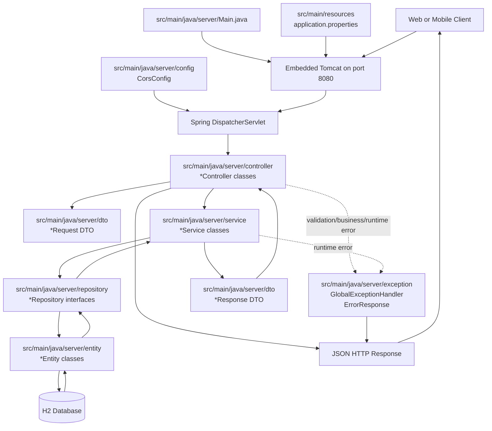

# Tutoring Manager - End-to-End Flow Schema

This diagram shows how an HTTP request moves through each backend subdirectory.

## Quick Role of Each Subdirectory

- `src/main/java/server/config`: Cross-cutting configuration (CORS, MVC behavior).
- `src/main/java/server/controller`: HTTP route handlers and request entry points.
- `src/main/java/server/dto`: Input/output payload contracts (`Request` and `Response`).
- `src/main/java/server/service`: Business logic and orchestration.
- `src/main/java/server/repository`: Data access layer through Spring Data JPA.
- `src/main/java/server/entity`: Database table mapping models.
- `src/main/java/server/exception`: Centralized error-to-HTTP-response mapping.

## End-to-End Summary

1. A request arrives on port `8080`.
2. `DispatcherServlet` routes to the matching controller method.
3. Controller validates/deserializes request DTO.
4. Service executes business logic.
5. Repository loads/saves entities in H2.
6. Service maps entity data into response DTO.
7. Controller returns JSON.
8. If any error occurs, `GlobalExceptionHandler` formats a consistent error response.
