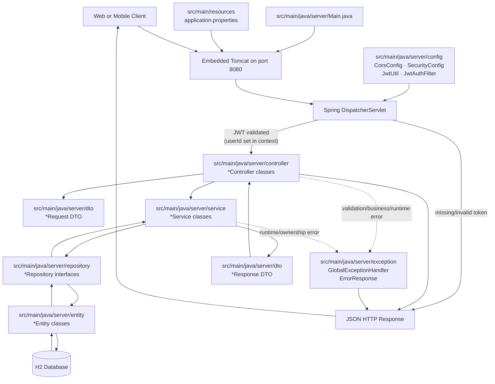

# Tutoring Manager - End-to-End Flow Schema

This diagram shows how an HTTP request moves through each backend subdirectory.

## Quick Role of Each Subdirectory

- `src/main/java/server/config`: Cross-cutting configuration — CORS, Spring Security filter chain, JWT token generation and validation.
- `src/main/java/server/controller`: HTTP route handlers and request entry points. Controllers read the authenticated userId from the security context.
- `src/main/java/server/dto`: Input/output payload contracts (`Request` and `Response`), plus auth DTOs (`RegisterRequest`, `LoginRequest`, `AuthResponse`).
- `src/main/java/server/service`: Business logic, ownership enforcement, and orchestration.
- `src/main/java/server/repository`: Data access layer through Spring Data JPA.
- `src/main/java/server/entity`: Database table mapping models.
- `src/main/java/server/exception`: Centralized error-to-HTTP-response mapping.

## End-to-End Summary

1. A request arrives on port `8080`.
2. `JwtAuthFilter` validates the `Authorization: Bearer <token>` header and sets the `userId` in the security context. Requests with no/invalid token are rejected with `401`.
3. `SecurityConfig` permits `/auth/**` without a token; all other routes require authentication.
4. `DispatcherServlet` routes to the matching controller method.
5. Controller reads the authenticated `userId` from the security context and passes it to the service.
6. Service executes business logic, verifies resource ownership (throws `403` if mismatched), and delegates to repositories.
7. Repository loads/saves entities in H2.
8. Service maps entity data into a response DTO.
9. Controller returns JSON.
10. If any error occurs, `GlobalExceptionHandler` formats a consistent error response.
