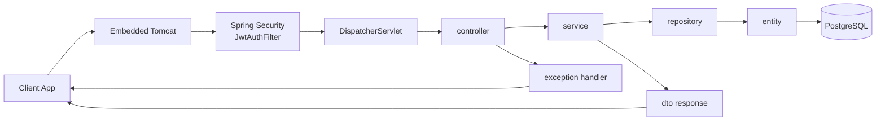

# Tutoring Manager API

Server-side REST API for managing students, classes, enrollments, tutoring sessions, and payments.

## Project Structure

- `pom.xml`: Spring Boot Maven project root
- `src/`: Java source code and resources
- `DB.sql`: SQL schema reference

## Architecture Flow



For the full end-to-end diagram and package responsibilities, see `FLOW_SCHEMA.md`.

## Tech Stack

- Java 21
- Spring Boot 3
- Spring Web (REST)
- Spring Security 6 + JWT (jjwt 0.12)
- Spring Data JPA
- PostgreSQL
- Maven
- Bean Validation
- OpenAPI/Swagger

## Run Locally

1. Open a terminal at the project root.
2. Start the API:

```bash
mvn spring-boot:run
```

3. API base URL:

```text
http://localhost:8080
```

## Authentication

The API uses JWT Bearer tokens. Obtain a token via `/auth/register` or `/auth/login`, then include it in all subsequent requests:

```
Authorization: Bearer <token>
```

## API Documentation

Swagger UI is available at:

```text
http://localhost:8080/swagger-ui.html
```

## Database Configuration

The app uses PostgreSQL. Connection settings are in:

- `src/main/resources/application.properties`

Default connection:

```
Host:     localhost:5432
Database: tutoring_db
User:     tutoring_user
Password: tutoring_pass
```

## Endpoints

Full endpoint list with request/response details: `API_ENDPOINTS.txt`

The API does not use a `/api` prefix (endpoints are like `/auth/login`, `/students`, `/payments`, etc.).

## Build

```bash
mvn clean compile
```

## Notes

- CORS is enabled for all origins.
- Delete operations are hard deletes.
- Pagination is supported on all list endpoints via `page` and `size` query params.
- `userId` is never passed by the client — it is derived from the JWT token on every request.
