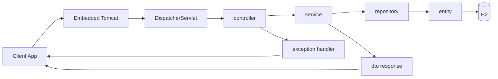

# Tutoring Manager API

Server-side REST API for managing students, classes, enrollments, tutoring sessions, and payments.

## Project Structure

- `pom.xml`: Spring Boot Maven project root
- `src/`: Java source code and resources
- `DB.sql`: SQL schema reference

## Architecture Flow



For the full end-to-end diagram and package responsibilities, see `FLOW_SCHEMA.md`.

## Tech Stack

- Java 21
- Spring Boot 3
- Spring Web (REST)
- Spring Data JPA
- H2 Database
- Maven
- Bean Validation
- OpenAPI/Swagger

## Run Locally

1. Open a terminal at the project root.
2. Start the API:

```bash
mvn spring-boot:run
```

3. API base URL:

```text
http://localhost:8080
```

## API Documentation

Swagger UI is available at:

```text
http://localhost:8080/swagger-ui.html
```

## Database Configuration

The app currently uses H2 in-memory DB and creates schema on startup via JPA:

- `spring.jpa.hibernate.ddl-auto=create`

Configuration file:

- `src/main/resources/application.properties`

## Endpoints

Endpoint lists are available in:

- `API_ENDPOINTS.txt`
- `API_ENDPOINTS_REPORT.txt`

The API does not use a `/api` prefix (endpoints are like `/students`, `/payments`, etc.).

## Build

```bash
mvn clean compile
```

## Notes

- CORS is enabled for all origins.
- Delete operations are hard deletes.
- Pagination is supported on list endpoints using query params such as `page` and `size`.
